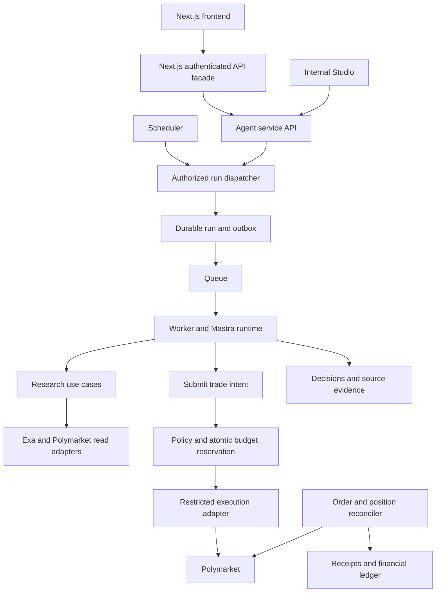

# Pickler agent runtime V1 specification

## Purpose and status

Build the shortest verifiable path from a configured agent to market research, an explicit trade or abstention decision, and eventually bounded autonomous execution on Polymarket. Run the agent independently of the product frontend so frontend development and agent experimentation can proceed separately.

Status: implementation specification, not implemented. The repository currently contains Next.js, a shared UI component, the three-layer health example, and empty Foundry directories. This change adds documentation only. No agents, provider connections, authentication, database, queue, scheduler, or trading credentials are operational.

The working technology direction is Mastra with Studio for experiments, Exa for initial web research, and Polymarket for initial market data and execution. Firecrawl is a later adapter option, not an installed integration. Provider package versions and infrastructure products must be selected and verified when implementation begins.

## Scope and decisions

| Decision | V1 direction |
| --- | --- |
| Agent runtime | One configurable Mastra agent definition serving isolated tenant/agent contexts |
| Tenant | Creator workspace; a workspace may contain multiple agents and members |
| Frontend | Existing Next.js app, developed independently |
| Initial interaction | Internal Mastra Studio and authenticated API requests |
| Research | Real market data and real web research; record attributable evidence |
| Trading | Research mode first, explicit paper mode next, separately authorized live mode |
| Capabilities | Stable domain ports with provider adapters and reviewed plugin manifests |
| Scheduling | Manual runs, fixed schedules, and bounded agent-requested follow-ups |
| Autonomy | No approval per order once live mode and its bounded policy are authorized |
| Exclusions | Launcher economics, token deployment, graduation, LP management, buybacks, arbitrary third-party code installation, and general cross-chain transfers |

Monad remains the product's launcher direction. The initial Polymarket execution account is a separate boundary. Do not imply that funds on Monad are directly spendable on Polymarket or automatically replenished from token purchases.

## Three-layer architecture

Presentation includes HTTP handlers, worker entry points, and scheduler triggers. Business lives in `packages/core`; provider and persistence implementations live in `packages/infrastructure`. Mastra-specific agent definitions and tool wrappers live in the new `apps/agent-service` host. They call business use cases rather than implementing financial policy.

Each executable application has its own composition root. Next.js retains its `server-only` boundary. The agent service has a server-only deployment boundary without depending on Next.js's `server-only` package. Core must never import Mastra, Next.js, provider SDKs, database clients, or queue libraries.



API, scheduler, and worker may initially run in one service deployment, but tasks and recovery state must be persistent. Long-running work is not attached to a Next.js request or an open browser tab. Studio must invoke the same guarded tools as the worker; it is not a bypass for live execution controls.

## Proposed folder map

All additions below are proposed. Existing files remain in place. Create directories as their implementation phase starts rather than adding empty packages for the entire roadmap.

```text
apps/
  web/src/
    app/api/v1/agents/[agentId]/runs/route.ts    # Authenticated frontend facade
    app/api/v1/runs/[runId]/route.ts
    server/agent-service-client.ts             # Server-to-server transport
    server/container.ts                        # Existing composition root
  agent-service/                               # New npm workspace
    AGENTS.md
    package.json
    src/
      composition/container.ts                 # Wires ports and adapters
      config/env.ts                            # Validate deployment configuration
      api/
        auth.ts                                # Verify callers and service identity
        agents.ts                              # Configuration and policy endpoints
        runs.ts                                # Dispatch, status, events, cancellation
        schedules.ts
      mastra/
        index.ts                               # Register agent and internal Studio
        agents/pickle.ts                       # Research behavior and output contract
        tools/research.ts                      # searchWeb, readPage
        tools/markets.ts                       # listMarkets, getMarketRules, order book
        tools/decisions.ts                     # Trade/abstention submission
        tools/follow-ups.ts                     # requestFollowUp
        skills/research/SKILL.md                # Versioned research procedure
      plugins/
        catalog.ts                             # Reviewed manifest and tool registrations
        resolve-tools.ts                       # Context-scoped permitted tool set
      workers/
        research-worker.ts
        reconciliation-worker.ts
        outbox-worker.ts
      scheduler/tick.ts
      evals/research.eval.ts
      test/tenant-isolation.test.ts
packages/
  core/src/features/
    identity/{domain,application,ports}/        # Workspaces, memberships, actors
    agents/{domain,application,ports}/          # Profile, config versions, activation
    capabilities/{domain,application,ports}/    # Plugin grants and capability policies
    research/{domain,application,ports}/        # Evidence, decisions, search/read ports
    markets/{domain,application,ports}/         # Categories, market rules and books
    execution/{domain,application,ports}/       # Intents, receipts, venue execution port
    budgets/{domain,application,ports}/         # Reservation and accounting invariants
    scheduling/{domain,application,ports}/      # Schedule and follow-up rules
    runs/{domain,application,ports}/            # Run lifecycle and dispatch/recovery
  core/test/                                   # Initial tests remain in current root glob
  infrastructure/src/
    research/exa-search.ts
    research/exa-reader.ts
    research/firecrawl-search.ts               # Later; only when actually implemented
    research/firecrawl-reader.ts               # Later
    polymarket/market-data.ts
    polymarket/execution.ts
    polymarket/reconciliation.ts
    persistence/                               # Tenant-scoped repositories and transactions
    persistence/migrations/
    queue/                                     # Selected queue adapter
    identity/                                  # Selected auth adapter
    credentials/                               # Tenant-scoped credential resolution
    agent-service/client.ts                    # Optional reusable transport adapter
  api-schema/src/
    agents.ts
    runs.ts
    schedules.ts
    decisions.ts
    errors.ts
```

The brace notation denotes three subdirectories, not literal filenames. Keep the agent-service HTTP client in the web app initially; move it to infrastructure only if multiple applications need it. Do not implement both copies.

`packages/ui`, `packages/chain`, and `contracts` require no changes for the first research milestone. Export shared types through declared package exports. The new Node service must bundle or compile source-exporting workspace dependencies; do not assume plain Node can execute the existing TypeScript source exports. Extend lint boundaries to the new service and declare its Turbo build outputs and test tasks when scaffolding it.

## Profile, mandate, capabilities, and provider bindings

These are separate, versioned configuration concepts:

- Profile: name, voice, research specialty, language, and research instructions. It influences behavior but grants no authority.
- Mandate: permitted venue categories/tags and markets, time horizon, strategy constraints, and mode (`research`, `paper`, `live`). Enforced by code.
- Capability grants: tools the agent may request, subject to workspace policy and current revocation state.
- Provider bindings: which reviewed implementation supplies a capability, plus a credential reference and validated provider configuration. Credentials never enter prompts or public responses.
- Budget policy: independent research/model spend and trading exposure limits. Required numeric limits must be explicitly configured; missing values deny the relevant paid or trading action.
- Schedule policy: fixed cadence, timezone, follow-up limits, and behavior after downtime.

Discover provider categories and tags through the market adapter. Store stable venue identifiers and optional display labels, not a permanent hardcoded category enumeration. Categories may overlap. Enforce the current permitted market universe before execution, even if the profile says something else.

Activating tools is the intersection of platform availability, workspace permission, agent grants, operation mode, actor authority, and current policy. Revalidate at execution time so disabling a tool blocks subsequent calls in an already-running conversation.

## Capability and plugin contracts

The following signatures are interface sketches. Referenced domain types must be defined and runtime schemas added during implementation; this is not a compilable SDK example.

```ts
interface WebSearch {
  search(input: SearchRequest, context: CapabilityContext): Promise<SearchResult[]>;
}
interface PageReader {
  read(input: ReadPageRequest, context: CapabilityContext): Promise<SourceDocument>;
}
interface MarketData {
  listCategories(context: CapabilityContext): Promise<MarketCategory[]>;
  listMarkets(input: MarketFilter, context: CapabilityContext): Promise<Market[]>;
  getMarket(id: string, context: CapabilityContext): Promise<MarketDetails>;
  getOrderBook(id: string, context: CapabilityContext): Promise<OrderBook>;
}
interface TradeIntentService {
  submit(input: TradeIntent, context: AuthorizedRunContext): Promise<IntentReceipt>;
}
interface FollowUpService {
  request(input: FollowUpRequest, context: AuthorizedRunContext): Promise<FollowUpDecision>;
}
```

`CapabilityContext` is constructed by trusted server code, never accepted as model arguments. It carries tenant, agent, run, actor, config version, deadline, and cancellation context. Credential references are resolved against that scope; raw credentials are not part of the model-visible contract.

Search inputs cover query, result limit, optional date/domain constraints, and deadline. Results preserve URL, title, available excerpts, retrieval time, optional publication time, and provider provenance. Page results preserve content and truncation indicators. Do not invent publication dates or silently drop unsupported filters. Normalize provider failures as unavailable, rate limited, invalid input, unsupported capability, or deadline exceeded. Retry safe reads within cost/time limits; fallback providers must be explicitly configured and recorded.

Market results preserve venue market ID, outcome IDs, related event ID, resolution rules, closing time, status, venue tags, and source timestamps. Order books carry bid/ask depth and observation time; a displayed last price is not an executable quote.

Each reviewed plugin manifest declares ID, version, contributed tool names, required capabilities, configuration schema version, compatible host contract version, and optional skill assets. Tool schemas and executors live in reviewed TypeScript modules. Example plugins: `research`, `prediction-markets`, and later `publishing` or `community`.

A plugin groups behavior; a provider adapter supplies a capability. `research` can bind search to Exa and page reading to a different compatible adapter. Switching providers creates a new configuration version. Do not replace a provider silently halfway through a run. Plugins must not access a global tenant, global mutable tool list, or arbitrary credential environment variables. Untrusted customer-installed executable plugins are out of V1 scope.

## Identity and isolation

Users belong to workspaces through memberships. Agents belong to one workspace. Community following or token ownership grants no workspace role.

Proposed roles: owner manages membership, credentials, live-mode activation, and policy expansion; operator runs, pauses, and monitors agents within approved policy; viewer reads permitted workspace resources. Platform administration is separate and must be audited. Role details are a product proposal to confirm before external onboarding.

Every run, schedule, decision, source document, thread, memory resource, credential binding, intent, receipt, and budget reservation is scoped to tenant and agent as applicable. Repository methods require trusted scope; database constraints must prevent cross-tenant references. An unguessable ID alone is not authorization. Shared public market caches may omit tenant scope only when their contents and credentials are genuinely public; private research and query histories must not leak through caching or retrieval.

Next.js authenticates the user and validates membership. The service authenticates its own caller and validates the delegated actor scope. Do not trust a browser-supplied tenant header. Scheduled jobs use a revocable service principal constrained to their agent; execution rechecks current grants and agent state. External runtimes, when introduced, receive separate scoped/revocable credentials, not a creator session or unrestricted wallet key.

The initial local lab may use an explicit development-only identity adapter with two fixture tenants, but that is not production authentication and must be impossible to enable accidentally in a public deployment. Production authentication provider selection remains open. Studio is internal operator tooling and must not be exposed as a tenant-facing administration panel.

## Research and decision workflow

1. Claim a run and capture immutable config/plugin/model versions. Check current agent state, actor authorization, and budget before paid work.
2. Select a permitted active market. Read exact outcome and resolution rules before generating search queries.
3. Research supporting and contradictory evidence using bounded searches. Treat retrieved text as untrusted data, not instructions or authorization.
4. Record source provenance, retrieval/publication times, material evidence, uncertainty, and limitations. Multiple articles repeating one source do not become independent confirmations.
5. Obtain a fresh executable-side quote and evaluate the thesis against price, fees, liquidity, and uncertainty. An LLM probability estimate is a hypothesis to evaluate, not calibrated certainty.
6. Produce either `TRADE` or `ABSTAIN`. Both are valid successful research outcomes. Record structured rationale and evidence; do not depend on access to hidden model reasoning.
7. In research mode, save the decision without execution. In paper mode, use an explicitly labeled simulated executor with documented fill assumptions. In live mode, submit an intent through deterministic policy and reservation checks.
8. Persist the result and optionally request a bounded follow-up. An agent cannot enable live mode, change its own limits, or grant itself tools.

Decision records contain market/outcome IDs, decision time, source references, thesis and counterevidence, optional estimated probability with uncertainty, quote observation time, proposed limit price and size if trading, expiry, invalidation conditions, config/model versions, and mode. Use exact decimal or atomic-unit representations for money and prices, never binary floating-point financial arithmetic. Public JSON serializes these as strings with explicit asset/unit metadata.

Research success and trading success are different. Store policy rejection and abstention reasons, as well as accepted decisions. Research cost is incurred even when no order is submitted.

## Execution, accounting, and recovery

Live intent states: `proposed → rejected | reserved → submitting → accepted | submission_unknown | failed`. An accepted venue order has a separate lifecycle: `open → partially_filled → filled | cancelled | expired`, allowing partial fills to precede cancellation. `submission_unknown` requires reconciliation, not blind resubmission. Position settlement and redemption are separate from both research and order status.

Intent submission validates enabled tools, venue eligibility, approved markets/outcomes, expiry, fresh price constraints, available funds, open-order exposure, per-event correlation limits, and global position limits. Recheck current revocations even when evaluating against a recorded policy version. V1 rejects execution from stale policy/config versions and requires a fresh evaluation.

Reserve funds atomically across concurrent requests and pending orders before external submission. Record the reservation, intent, and durable dispatch event transactionally; an outbox prevents lost jobs between a database commit and queue publication. Queue processing assumes at-least-once delivery. Use application deduplication and venue identifiers/signed-order identity as supported; do not assume a venue accepts a generic idempotency header.

Partial fills consume the filled amount and retain only the still-needed reservation. Release unused reservations only after a terminal order state is confirmed. A timeout or worker crash must not release funds for an order that may exist. Keep append-only accounting entries for deposits, research costs, reservations, fills, fees, releases, and realized results. Deposits are not profits. Research and trading budgets are independent.

A restricted server executor owns signing and authenticated venue access; the model never receives keys or a generic signing tool. Effective wallet/venue restrictions, custody, collateral, permissions, withdrawal authority, and geographic eligibility must be verified before live activation. Platform policy checks alone must not be described as on-chain enforcement.

Pausing research blocks new research runs and new positions. Continue reconciliation and permitted risk-reducing cancellation/closure. In-flight external orders cannot be assumed cancelled just because an internal run is cancelled. Define initial exit behavior before live mode; the current proposal is no autonomous discretionary selling until that policy is explicitly approved.

## Scheduling and autonomous follow-ups

Supported V1 triggers: manual request, fixed interval or timezone-aware calendar schedule, and an approved follow-up requested by the agent. Event-driven research is a later extension; execution reconciliation remains required independently.

Persist schedules with ID, tenant/agent, version, enabled state, cadence, IANA timezone where applicable, next UTC due time, minimum follow-up interval, maximum research runs per budget window, and budget policy reference. Use UTC instants for stored due times. Calendar schedules must define daylight-saving behavior: skip nonexistent local times and run repeated local times once. Fixed intervals are UTC elapsed durations and have no DST adjustment.

A follow-up request includes requested time, reason, related market, and parent run ID. The business service approves, defers, or rejects it based on minimum delay, remaining daily run/cost budget, agent state, and existing pending work. Enforce limits across both fixed and adaptive triggers. V1 permits one pending follow-up per agent/market and one active research run per agent.

The scheduler periodically claims due occurrences with a lease and unique `(scheduleId, scheduleVersion, dueAt)` occurrence key, creates a durable run/outbox entry, and advances due time transactionally. A second scheduler or retry cannot create a second run for the same occurrence. Workers use leases, heartbeat/expiry, and fencing or equivalent stale-worker protection; a lease timeout alone does not prove an external action never happened.

After downtime, coalesce missed research occurrences into at most one current run per agent; record skipped occurrences rather than executing a burst of stale research. Reconciliation tasks must catch up on outstanding orders. Edits/disable operations invalidate obsolete schedule versions; queued jobs recheck state before acting. If a run is already active, coalesce pending research and preserve trigger provenance.

Do not use an in-memory `setInterval` as the sole scheduling record or an LLM call to keep time. API, scheduler, and worker may share a deployment initially, while the database and queue preserve recovery state.

## Frontend and service API contract

The following endpoints are proposed public Pickler contracts, not currently available routes. Implement shared runtime-validated DTOs in `packages/api-schema`. The existing health endpoint remains unchanged.

| Method and path | Behavior |
| --- | --- |
| `POST /api/v1/agents` | Create a workspace-scoped draft agent |
| `GET /api/v1/agents/:agentId` | Read authorized profile/configuration and state |
| `PATCH /api/v1/agents/:agentId/config` | Validate and create a config version; require expected version |
| `POST /api/v1/agents/:agentId/runs` | Manual dispatch; require an idempotency key; return 202 with run ID |
| `GET /api/v1/runs/:runId` | Read status, safe result, decision references, and mode |
| `GET /api/v1/runs/:runId/events` | Authorized resumable events with sequence IDs; polling is sufficient for first UI |
| `POST /api/v1/runs/:runId/cancel` | Request cancellation; does not claim venue orders were cancelled |
| `PUT /api/v1/agents/:agentId/schedule` | Validate and version a fixed/adaptive schedule |
| `POST /api/v1/agents/:agentId/pause` | Pause new research and risk-taking; retain reconciliation |
| `POST /api/v1/agents/:agentId/resume` | Resume only after authorization and configuration checks |
| `GET /api/v1/agents/:agentId/decisions` | Paginated research and abstention history |
| `GET /api/v1/agents/:agentId/orders` | Paginated execution status and receipts |

Policy expansion and live activation require separate privileged commands; a generic configuration patch must not grant them. Exact activation DTOs depend on the approved wallet and policy model.

Run states: `queued`, `running`, `completed`, `failed`, `cancel_requested`, `cancelled`. Store trigger, timestamps, attempt, config version, and result references. A completed research run may result in abstention or policy rejection; an accepted order may remain unresolved after the run completes. Do not encode all these states in one status field.

Errors use `{ code, message, requestId }` with safe messages. Distinguish invalid input (400), missing authentication (401), forbidden operation (403), non-visible resource (404), version/idempotency conflict (409), and quotas (429). Reusing an idempotency key with a different payload is a conflict. Internal failures never expose credentials or raw provider exceptions.

The Next.js facade authenticates and forwards verified scope to the private service. The browser never receives service credentials. Any future chat streaming adapter must match the chosen AI SDK protocol/version; chat is an interaction surface, not the durable job record. Frontend work can start against these contracts with explicitly labeled fixtures without claiming integrations are live.

## Persistence and observability

Initial logical records: users, workspaces, memberships, agents, config versions, plugin grants, credential references, schedules, schedule occurrences, runs, run events, evidence sources, research decisions, trade intents, orders, fills, budget accounts, ledger entries, reservations, outbox entries, and follow-ups. Group records into actual tables according to the chosen database; these are responsibilities rather than a requirement for one table per noun.

Correlate tenant, agent, run, decision, intent, reservation, and venue order IDs. Track model/search consumption, retries, freshness, abstentions, policy rejections, scheduler lag, duplicate prevention, reconciliation backlog, and realized outcomes net of attributable costs. Record research evidence before outcomes to avoid hindsight evaluation. Keep public evidence separate from internal traces and private sources; record human interventions. Set retention/access rules before external tenant onboarding.

## Implementation sequence and acceptance criteria

| Phase | Deliverable | Acceptance criteria |
| --- | --- | --- |
| 1 Contracts and isolation | Domain types, validated DTOs, tenant scope, config versions, reviewed plugin resolution | Two fixture tenants cannot access each other's agents or histories; disabled tools fail even during an existing run; unknown/missing scope denies access |
| 2 Research vertical slice | Mastra host/Studio, Exa search/read, Polymarket reads, persisted decisions | Real market produces a sourced TRADE or ABSTAIN decision; tool/provider provenance and costs recorded; no trading calls available in research mode |
| 3 Durable scheduling | Queue/outbox, worker, fixed cadence and follow-ups | Duplicate dispatch creates one run; restart preserves due work; pause blocks queued research; follow-up limits and DST behavior tested |
| 4 Paper execution | Policy, reservations, simulated execution and reconciliation | Concurrent intents cannot overspend; partial fills and unknown outcomes exercised; simulation is clearly labeled and does not imply real fill performance |
| 5 Bounded live pilot | Approved account/signer, authenticated venue adapter, reconciliation | Eligibility/control checks completed; unknown submission reconciled before retry; no duplicate orders; restrictions/revocation enforced; live mode explicitly authorized |
| 6 Product integration | Next.js facade and creator-facing views | Authenticated users can trigger/monitor allowed runs; no internal Studio or credentials exposed; agent/order/token states remain distinct |

The frontend can develop in parallel from the contract after phase 1. Do not wait for token contracts to validate research. Do not interpret approval of this specification as authorization to fund an account or submit live orders.

## Validation strategy

Business tests cover tenant access, market permissions, stale versions, budget exhaustion, concurrent reservations, revocation, follow-up bounds, pause semantics, and idempotency conflicts. Adapter tests cover response schemas, provenance, timeouts, rate limits, quote freshness, partial fills, and uncertain submissions. Worker tests cover crash recovery, lease expiry, outbox replay, duplicate delivery, and schedule edits. Evals assess source attribution, contrary evidence, abstention, and probability calibration over resolved outcomes; profitable performance is not an acceptance assumption.

Add test scripts for the new host and adapter suites when those files exist. The current root `npm test` only discovers `packages/core/test/*.test.ts`. Extend discovery deliberately. Validate API DTO compatibility with the frontend and build the new service with its workspace dependencies. Documentation-only changes do not require runtime tests.

## Open decisions before implementation or live use

Before provisioning: select model, authentication provider, database, queue, hosting, and credential store; define numeric research limits and the first evaluation market subset. Before public onboarding: confirm role permissions, retention, tenant isolation, and Studio access controls. Before live execution: confirm venue/account eligibility, wallet and signer authority, collateral/funding, all financial limits, exit policy, and incident ownership. These are explicit unresolved choices, not hidden defaults.

## References and provenance

This specification consolidates the project discussion and the supplied product document. It narrows the first build to agent operation; it does not replace or approve the launcher's unresolved economics. Provider behavior must be verified against current official documentation and pinned dependencies during implementation.

- [Mastra Studio](https://mastra.ai/docs/studio/overview)
- [Mastra request context](https://mastra.ai/docs/server/request-context)
- [Mastra and Next.js](https://mastra.ai/integrations/frameworks/next-js)
- [Polymarket APIs](https://docs.polymarket.com/getting-started/api)
- [Polymarket geographic restrictions](https://docs.polymarket.com/api-reference/geoblock)
- [Exa search](https://exa.ai/docs/reference/search)
- [Firecrawl search](https://docs.firecrawl.dev/api-reference/endpoint/search)
